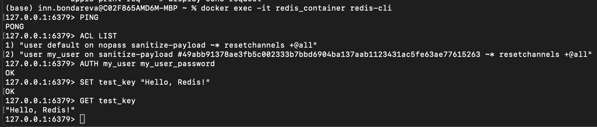

# Redis

## Задание

Необходимо:

- сохранить большой жсон (~20МБ) в виде разных структур - строка, hset, zset, list;
- протестировать скорость сохранения и чтения;
- предоставить отчет.

Задание повышенной сложности*
- настроить редис кластер на 3х нодах с отказоусточивостью, затюнить таймоуты

## Single Redis instance

#### 1. Подготовка docker-compose.yml
Для настройки конфига скачиваем файл для версии 7.2 [redis.conf](https://raw.githubusercontent.com/redis/redis/7.2/redis.conf)

Добавляем 
```bash
bind 0.0.0.0 - чтобы подключаться извне
requirepass $REDIS_PASSWORD
```

Пока что без
```bash
appendonly yes
appendfsync everysec
```

Также добавляем файл [Access Control List](https://redis.io/docs/latest/operate/oss_and_stack/management/security/acl/)

Получается [docker-compose.yml](./HW13/docker-compose.yml)

Проверяем работоспособность



#### 2. Подключение к Redis с помощью python

Используем jupyter notebook для наглядности (финальный вариант [testing_data.ipynb](./HW13/testing_data.ipynb)), сначала подключаемся к redis с помощью одноименной библиотеки, для установки вводим

```bash
pip install redis
```
Подключение выглядит следующим образом:

```python
    r = redis.Redis(
        host=REDIS_HOST,
        port=REDIS_PORT,
        username=REDIS_USER, 
        password=REDIS_PASSWORD, 
        decode_responses=True,
    )

    if r.ping():
        print("Успешное подключение к Redis!")
    else:
        print("Ошибка: Redis не ответил на PING")
```
#### 3. Наполнение данными
- сохранить большой жсон (~20МБ) в виде разных структур - строка, hset, zset, list;
- протестировать скорость сохранения и чтения;
- предоставить отчет.

Задание в jupyter notebook [testing_data.ipynb](./HW13/testing_data.ipynb)