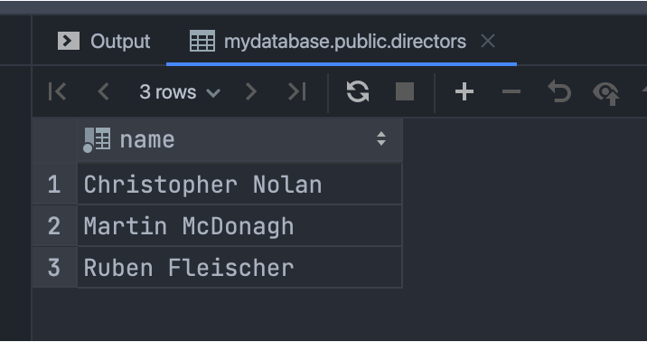
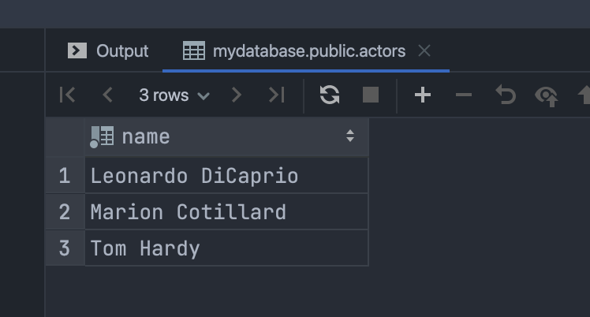
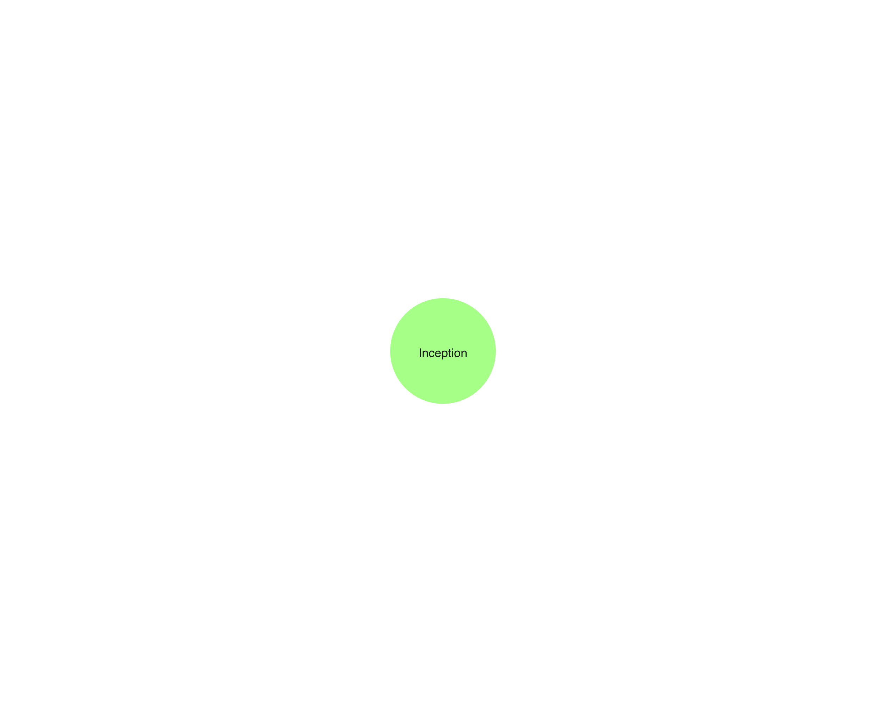
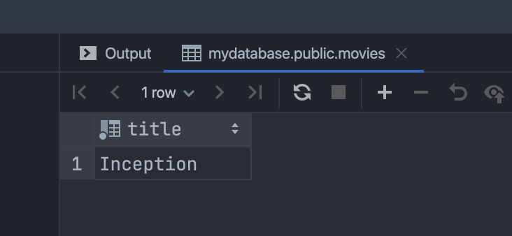
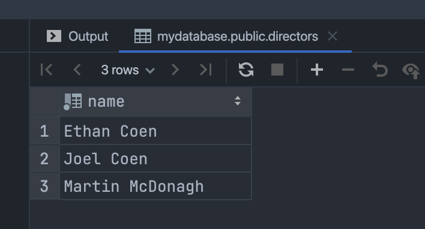

# Neo4j

## Задание

- Придумать 2-3 варианта, когда применима графовая база данных. Можно даже абзац на контекст каждого примера.
- Воспользоваться моделью, данными и командами из лекции или одним из своих примеров из пункта 1 и реализовать аналог в любой выбранной БД (реляционной или нет - на выбор). Сравнить команды.
- Написать, что удобнее было сделать в выбранной БД, а что в Neo4j и привести примеры.


## 1. Примеры использования графовых БД

### Вариант 1: Цепочки поставок
Сложные цепочки поставок будет удобно представить в виде графа, чтобы выявлять узкие места (например, зависимость от одного поставщика), моделировать риски сбоев (задержки транспорта) и оптимизировать логистику. В отличие от табличных БД, в графовых можно отобразить взаимосвязи между участниками и анализировать влияния изменений. Так можно ответить на вопросы, например, "что будет, если поставщик X задержится?". Это полезно для управления рисками и снижения издержек.
- **Вершины:** Поставщик, продукт, склад, транспорт
- **Ребра:** 
  - `ПОСТАВЛЯЕТ` - поставщик поставляет продукт, можно добавить информацию об объеме, стоимости, сроке поставки
  - `ХРАНИТСЯ_НА` - продукт хранится на складе в определенном количестве
  - `ТРАНСПОРТИРУЕТ` - связь транспорта и склада, как атрибут подходит время в пути, статус доставки
  - `ЗАВИСИТ_ОТ` - связь между продуктами, может быть критично при доставке сырья для производства готовой еды.

### Вариант 2: Моделирование эпидемиологических контактов
Графы идеально подходят для эпидемиологического моделирования, так как позволяют естественно отображать сложные сети контактов. Этот пример похож на социальную сеть, но источник данных и особенности отличаются. С помощью графа можно быстро находить пути распространения инфекции (например, через 3+ уровней контактов), выявлять суперраспространителей и скрытые кластеры. В отличие от реляционных БД, графы эффективно работают с динамическими связями (например, временными контактами) и поддерживают анализ в реальном времени что критично для оперативного реагирования на вспышки.

- **Вершины:** Человек, локация, событие (собрание людей, может отличаться по массовости)
- **Ребра:**  
  - `КОНТАКТИРОВАЛ` - тип контакта, вероятность передачи 
  - `ПОСЕТИЛ` - связь человека и локации
  - `ПЕРЕДАЛ_ИНФЕКЦИЮ` - связь между людьми, атрибуты: какую именно инфекцию, в какое время


### Вариант 3: Сетевая инфраструктура
Моделирование топологии сети (серверы, маршрутизаторы, соединения) для анализа критических узлов, поиска оптимальных маршрутов и выявления уязвимостей.

- **Вершины:** Устройство, интерфейс, сеть, сервис
- **Ребра:**  
  - `СОЕДИНЕН` - связь между интерфейсами
  - `ПРИНАДЛЕЖИТ` - связь интерфейса и устройства
  - `НАХОДИТСЯ_В` - связь устройства в сети
  - `ЗАВИСИТ_ОТ` - связь сервиса с другим сервисом или устройством

## 2. Реализация аналога в реляционной БД (PostgreSQL)

### Создание таблиц

```sql
-- Создаем таблицы для сущностей
CREATE TABLE directors (
    id SERIAL PRIMARY KEY,
    name VARCHAR(100) NOT NULL,
    born INTEGER
);

CREATE TABLE actors (
    id SERIAL PRIMARY KEY,
    name VARCHAR(100) NOT NULL
);

CREATE TABLE movies (
    id SERIAL PRIMARY KEY,
    title VARCHAR(100) NOT NULL,
    year INTEGER,
    name VARCHAR(100)
);

-- Создаем таблицы для связей
CREATE TABLE created (
    director_id INTEGER REFERENCES directors(id),
    movie_id INTEGER REFERENCES movies(id),
    PRIMARY KEY (director_id, movie_id)
);

CREATE TABLE played_in (
    actor_id INTEGER REFERENCES actors(id),
    movie_id INTEGER REFERENCES movies(id),
    character VARCHAR(100),
    PRIMARY KEY (actor_id, movie_id)
);
```

### Вставка данных

Команда в Neo4j с созданием узлов (режиссеры, актер и фильм) и трех ребер (играл в, создал/срежессировал)
```sql
create (:Director {name:'Joel Coen'}) -[:CREATED]-> (blood:Movie {title:'Blood Simple', year:1983}) <-[:PLAYED_IN {character: 'Abby'}]- (:Actor {name: 'Frances McDormand'})
create (:Director {name:'Ethan Coen', born:1957}) -[:CREATED]-> (blood)
```

Для написания аналога в Postgresql потребуется сначала вставлять записи в справочники, то есть справочник = узел. А затем вставлять записи в таблицы связей между справочниками (аналог ребер). Команды могут выглядеть так:
```sql
INSERT INTO directors (name) VALUES ('Joel Coen');
INSERT INTO directors (name, born) VALUES ('Ethan Coen', 1957);

INSERT INTO movies (title, year) VALUES ('Blood Simple', 1983);

INSERT INTO actors (name) VALUES ('Frances McDormand');

INSERT INTO created VALUES 
    ((SELECT id FROM directors WHERE name = 'Joel Coen'), 
     (SELECT id FROM movies WHERE title = 'Blood Simple')),
    ((SELECT id FROM directors WHERE name = 'Ethan Coen'), 
     (SELECT id FROM movies WHERE title = 'Blood Simple'));

INSERT INTO played_in VALUES 
    ((SELECT id FROM actors WHERE name = 'Frances McDormand'),
     (SELECT id FROM movies WHERE title = 'Blood Simple'),
     'Abby');
```

Команды в Neo4j по наполнению данными (в примере был match, но данные необходимо сначала вставить)
```sql
create (frances:Actor {name:'Frances McDormand'}),
       (leo:Actor {name:'Leonardo DiCaprio'})
create (:Director {name:'Martin McDonagh'}) -[:CREATED]-> (billboards:Movie {title:'Three Billboards Outside Ebbing, Missouri'})
create (frances) -[:PLAYED_IN]-> (billboards)
create (venom:Movie {title:'Venom'}) <-[:PLAYED_IN]- (woodie:Actor {name:'Woody Harrelson'}) -[:PLAYED_IN]-> (billboards)
create (venom) <-[:PLAYED_IN]- (tom:Actor {name:'Tom Hardy'})
create (leo) -[:PLAYED_IN]-> (inception:Movie {name:'Inception'}) <-[:PLAYED_IN]- (tom)
create (marion:Actor {name:'Marion Cotillard'}) -[:PLAYED_IN]-> (inception)
create (marion) -[:PLAYED_IN]-> (batman:Movie {title: 'The Dark Knight Rises'}) <-[:PLAYED_IN]- (tom)
create (nolan:Director {name:'Christopher Nolan'}) -[:CREATED]-> (batman)
create (nolan) -[:CREATED]-> (inception)
create (:Director {name:'Ruben Fleischer'}) -[:CREATED]-> (venom)
```

Перепишем на postgresql
```sql
--Заполнение справочников
INSERT INTO directors (name) VALUES 
    ('Martin McDonagh'),
    ('Christopher Nolan'),
    ('Ruben Fleischer');

INSERT INTO actors (name) VALUES 
    ('Leonardo DiCaprio'),
    ('Woody Harrelson'),
    ('Tom Hardy'),
    ('Marion Cotillard');

INSERT INTO movies (title) VALUES 
    ('Three Billboards Outside Ebbing, Missouri'),
    ('Venom'),
    ('The Dark Knight Rises');

INSERT INTO movies (name, title) VALUES 
    ('Inception', 'Inception');

-- Связи между сущностями
INSERT INTO created VALUES
    ((SELECT id FROM directors WHERE name = 'Martin McDonagh'),
     (SELECT id FROM movies WHERE title = 'Three Billboards Outside Ebbing, Missouri')),
    ((SELECT id FROM directors WHERE name = 'Christopher Nolan'),
     (SELECT id FROM movies WHERE title = 'The Dark Knight Rises')),
    ((SELECT id FROM directors WHERE name = 'Christopher Nolan'),
     (SELECT id FROM movies WHERE name = 'Inception')),
    ((SELECT id FROM directors WHERE name = 'Ruben Fleischer'),
     (SELECT id FROM movies WHERE title = 'Venom'));

INSERT INTO played_in VALUES
    ((SELECT id FROM actors WHERE name = 'Frances McDormand'),
     (SELECT id FROM movies WHERE title = 'Three Billboards Outside Ebbing, Missouri'),
     NULL),
    ((SELECT id FROM actors WHERE name = 'Woody Harrelson'),
     (SELECT id FROM movies WHERE title = 'Venom'),
     NULL),
    ((SELECT id FROM actors WHERE name = 'Woody Harrelson'),
     (SELECT id FROM movies WHERE title = 'Three Billboards Outside Ebbing, Missouri'),
     NULL),
    ((SELECT id FROM actors WHERE name = 'Tom Hardy'),
     (SELECT id FROM movies WHERE title = 'Venom'),
     NULL),
    ((SELECT id FROM actors WHERE name = 'Leonardo DiCaprio'),
     (SELECT id FROM movies WHERE name = 'Inception'),
     NULL),
    ((SELECT id FROM actors WHERE name = 'Tom Hardy'),
     (SELECT id FROM movies WHERE name = 'Inception'),
     NULL),
    ((SELECT id FROM actors WHERE name = 'Marion Cotillard'),
     (SELECT id FROM movies WHERE name = 'Inception'),
     NULL),
    ((SELECT id FROM actors WHERE name = 'Marion Cotillard'),
     (SELECT id FROM movies WHERE title = 'The Dark Knight Rises'),
     NULL),
    ((SELECT id FROM actors WHERE name = 'Tom Hardy'),
     (SELECT id FROM movies WHERE title = 'The Dark Knight Rises'),
     NULL);
```

### Выполнение запросов

#### Поиск режиссеров, связанных с фильмом "Venom"

Запрос на neo4j
```sql
--23 найти ноду имеющую связь с другой нодой с указанием метки Label нод
match (venom:Movie {title:'Venom'}) -[*1..3]- (d:Director) return d
```

Результат (Нолан почему-то два раза, но в виде графа три узла, то есть дубликат схлопнулся)
```
(:Director {name: "Christopher Nolan"})
(:Director {name: "Christopher Nolan"})
(:Director {name: "Martin McDonagh"})
(:Director {name: "Ruben Fleischer"})
```

Вариант на postgresql
```sql
SELECT DISTINCT d.name
FROM directors d
JOIN created c ON d.id = c.director_id
JOIN movies m1 ON c.movie_id = m1.id
JOIN played_in pi ON m1.id = pi.movie_id
JOIN actors a ON pi.actor_id = a.id
JOIN played_in pi2 ON a.id = pi2.actor_id
JOIN movies m2 ON pi2.movie_id = m2.id
WHERE m2.title = 'Venom'
```

Результат выполнения запроса:



### Дополнительные запросы

1. Найти всех актеров, снимавшихся у Кристофера Нолана:
Neo4j
```cypher
   MATCH (d:Director {name:'Christopher Nolan'})-[:CREATED]->(m:Movie)<-[:PLAYED_IN]-(a:Actor) 
   RETURN a.name
```

Результат выполнения
```
(:Actor {name: "Leonardo DiCaprio"})
(:Actor {name: "Tom Hardy"})
(:Actor {name: "Marion Cotillard"})
```

В PostgreSQL потребуются сложные JOIN 
```sql
SELECT DISTINCT a.name
FROM actors a
JOIN played_in pi ON a.id = pi.actor_id
JOIN movies m ON pi.movie_id = m.id
JOIN created c ON m.id = c.movie_id
JOIN directors d ON c.director_id = d.id
WHERE d.name = 'Christopher Nolan';
```



2. Найти фильмы, в которых снимались и Том Харди, и Леонардо ДиКаприо:

Neo4j
```cypher
MATCH (tom:Actor {name: 'Tom Hardy'})-[:PLAYED_IN]->(movie:Movie)<-[:PLAYED_IN]-(leo:Actor {name: 'Leonardo DiCaprio'})
RETURN movie
```



```sql
SELECT m.title
FROM movies m
JOIN played_in pi1 ON m.id = pi1.movie_id
JOIN actors a1 ON pi1.actor_id = a1.id
JOIN played_in pi2 ON m.id = pi2.movie_id
JOIN actors a2 ON pi2.actor_id = a2.id
WHERE a1.name = 'Tom Hardy' AND a2.name = 'Leonardo DiCaprio';
```



3. Найти режиссеров, которые работали с Фрэнсис МакДорманд:

Neo4j
```cypher
MATCH (frances:Actor {name: 'Frances McDormand'})-[:PLAYED_IN]->(movie:Movie)<-[:CREATED]-(director:Director)
RETURN DISTINCT director
```

Результат
```
(:Director {name: "Joel Coen"})
(:Director {born: 1957, name: "Ethan Coen"})
(:Director {name: "Martin McDonagh"})
```

Аналог на postgresql

```sql
SELECT DISTINCT d.name
FROM directors d
JOIN created c ON d.id = c.director_id
JOIN movies m ON c.movie_id = m.id
JOIN played_in pi ON m.id = pi.movie_id
JOIN actors a ON pi.actor_id = a.id
WHERE a.name = 'Frances McDormand';
```



### 3. Сравнение Neo4j и PostgreSQL

#### Что удобнее в Neo4j:
1. Запросы на связи
2. Обход графа: Поиск путей между актерами через общие фильмы выполняется в Neo4j естественно, в SQL требует рекурсивных запросов.

#### Что удобнее в PostgreSQL:
1. Сложные агрегации. Например, подсчет среднего года выпуска фильмов для каждого режиссера
2. Транзакции и ACID для операций, требующих строгой согласованности данных.

## Вывод
Графовые БД лучше подходят для задач с частыми запросами на связи и обход графа, тогда как реляционные - для сложных агрегаций и транзакционных операций. Выбор зависит от конкретных требований приложения.
Графовая БД автоматически учитывает только релевантные пути благодаря графовой модели, табличная требует явного контроля связей, иначе находит все возможные комбинации через JOIN.
