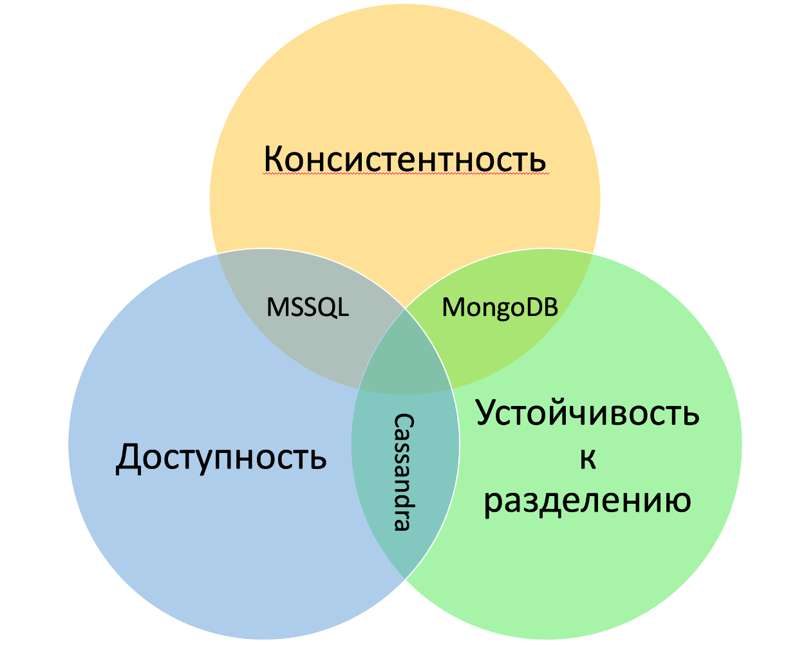

# Классификация СУБД по теореме CAP: Анализ MongoDB, MSSQL и Cassandra

## Введение

Теорема CAP утверждает, что в распределенных системах невозможно одновременно обеспечить три свойства: согласованность (Consistency), доступность (Availability) и устойчивость к разделению (Partition Tolerance). Это означает, что при проектировании распределенных систем необходимо делать компромиссы, выбирая, какие из этих свойств будут приоритетными в зависимости от требований конкретного приложения.

## MongoDB

MongoDB — это документно-ориентированная NoSQL база данных, которая позволяет хранить данные в виде документов, похожих на JSON. Это делает MongoDB гибкой и удобной для работы с различными типами данных. Кластер MongoDB состоит из нескольких экземпляров, которые работают вместе, чтобы поддерживать однородный набор данных. В этой системе есть основной узел, который выполняет все операции записи, и вторичные узлы, которые получают копии данных от основного узла.

По умолчанию основной узел обрабатывает все операции чтения и записи. Однако клиент MongoDB может настроить маршрутизацию некоторых или всех операций чтения на вторичные узлы. Записи, в свою очередь, обязательно должны отправляться на основной узел.

### Доступность и устойчивость к разделению

По умолчанию все операции чтения и записи обрабатываются основным узлом. Однако разработчики могут настроить систему так, чтобы некоторые запросы на чтение направлялись на вторичные узлы. Это может помочь разгрузить основной узел и повысить производительность. Если основной узел выходит из строя, все операции записи приостанавливаются, пока не будет выбран новый основной узел из числа вторичных. Этот процесс может занять до 12 секунд. 

Для повышения доступности кластер MongoDB может быть распределен по различным географическим регионам. Максимально допустимое количество узлов в репликационном наборе MongoDB составляет 50. Распределенность позволяет системе продолжать функционировать в условиях сетевых сбоев.

Получается, что MongoDB может жертвовать строгой согласованностью, то есть данные могут быть временно несогласованными между узлами.

## MSSQL

MSSQL — это реляционная система управления базами данных, которая хранит данные в таблицах. Она обеспечивает высокую степень согласованности и надежность, что делает ее популярной в корпоративных приложениях, где важна точность данных.

MSSQL использует клиент-серверную архитектуру, где сервер базы данных управляет данными и отвечает на запросы от клиентов. В отличие от NoSQL систем, MSSQL работает с жесткой структурой данных — таблицами, строками и столбцами. Это позволяет обеспечить строгую согласованность данных.

### Согласованность и доступность

В MSSQL каждая транзакция должна быть либо успешно завершена, либо полностью откатана, что гарантирует целостность данных. Это достигается с помощью механизмов блокировок и журналов транзакций. Однако такая высокая степень согласованности может негативно сказываться на доступности. Если система сталкивается с сетевыми проблемами или отказом сервера, она может временно стать недоступной, чтобы защитить данные от потери. Таким образом, MSSQL больше ориентирован на согласованность и доступность, но может не обеспечивать устойчивость к разделению.

## Cassandra

Apache Cassandra — это распределенная NoSQL база данных, которая подходит для работы с большими объемами данных. Она спроектирована так, чтобы быть высокодоступной и масштабируемой, то есть подходит для приложений, в которых требуется быстрая обработка информации.

Кластер Cassandra состоит из множества узлов, которые работают в равноправной архитектуре "peer-to-peer". В этой системе нет главного узла, и каждый узел может выполнять все операции с данными. Данные распределяются по узлам на основе хеширования ключа партиционирования. Партиция может содержать одну или несколько строк, и каждый узел может иметь несколько партиций, но каждая партиция хранится только на одном узле.

### Устойчивость к разделению и доступность

Cassandra использует фактор репликации, который определяет, сколько копий данных должно быть создано. Эти копии автоматически распределяются по различным узлам, что повышает доступность данных. Узел, который первым получает запрос от клиента, становится координатором. Его задача — перенаправить запрос на узлы, которые хранят необходимые данные, и вернуть результаты обратно клиенту. Любой узел может выполнять роль координатора.

Cassandra обеспечивает доступность и устойчивость к разделению, но может жертвовать строгой согласованностью. Это означает, что данные могут быть временно несогласованными между узлами, но система продолжает работать даже в случае сбоев.

## Итог

