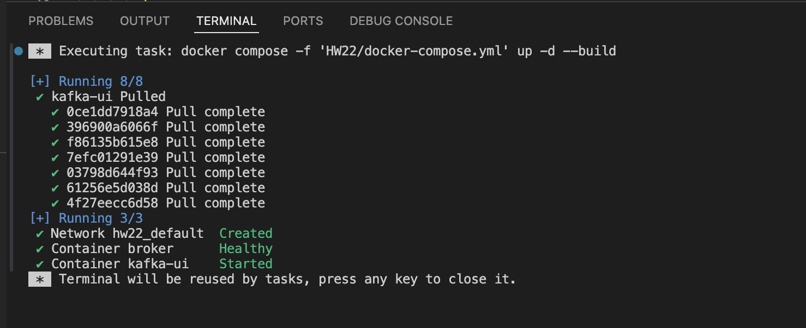
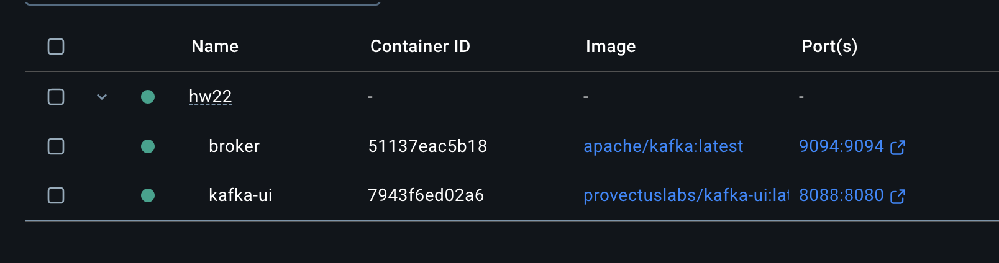
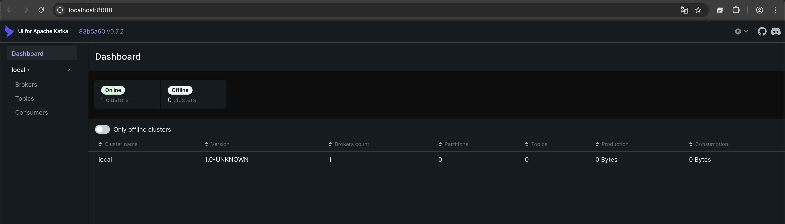
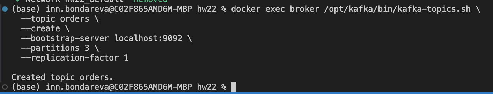
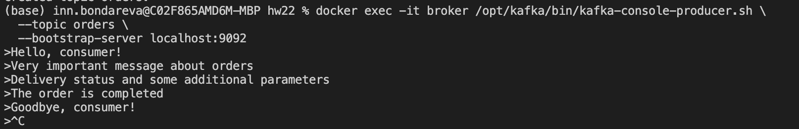
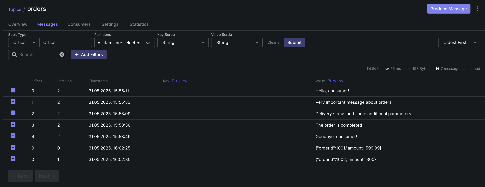
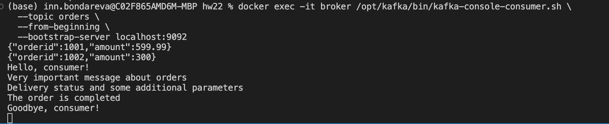

# Kafka

## Задание


- Запустите Kafka (можно в docker)
- Отправьте несколько сообщений используя утилиту kafka-producer
- Прочитайте их, используя графический интерфейс или утилиту kafka-consumer
- Отправьте и прочитайте сообщения программно - выберите знакомый язык программирования (C#, Java, Python или любой другой, для которого есть библиотека для работы с Kafka), отправьте и прочитайте несколько сообщений

    Для пунктов 2 и 3 сделайте скриншоты отправки и получения сообщений.
    
    Для пункта 4 приложите ссылку на репозитарий на гитхабе с исходным кодом.


## Установка

### 1. Заполнение docker-compose.yml 

[Файл docker-compose.yml](./HW4/docker-compose.yml )

Раньше Kafka зависела от ZooKeeper для хранения метаданных (топики, партиции, офсеты и т. д.), теперь сама управляет своим состоянием через встроенный Raft-консенсус, убирая зависимость от ZooKeeper. KRaft позволяет Kafka масштабироваться до миллионов партиций (в тестах Apache Kafka 3.7+ поддерживает десятки миллионов партиций). В KRaft перевыборы лидера происходят быстрее, так как Kafka сама управляет консенсусом

Kafka Configuration:

- KAFKA_NODE_ID: Unique identifier for the broker
- KAFKA_PROCESS_ROLES: Broker and controller roles
- KAFKA_LISTENERS: Listeners for different protocols
- KAFKA_ADVERTISED_LISTENERS: Addresses advertised to clients
- KAFKA_LISTENER_SECURITY_PROTOCOL_MAP: Security protocol map
- KAFKA_INTER_BROKER_LISTENER_NAME: Inter-broker listener name
- KAFKA_CONTROLLER_QUORUM_VOTERS: Controller quorum voters
- KAFKA_CONTROLLER_LISTENER_NAMES: Controller listener names
- KAFKA_OFFSETS_TOPIC_REPLICATION_FACTOR: Offsets topic replication factor
- KAFKA_TRANSACTION_STATE_LOG_REPLICATION_FACTOR: Transaction state log replication factor
- KAFKA_TRANSACTION_STATE_LOG_MIN_ISR: Transaction state log minimum ISR


### 2. Запуск docker compose up -d





После запуска контейнеров можем зайти и посмотреть UI http://localhost:8088 



Для подключения к брокеру используются такие URL:

При запуске вне докера:
- localhost:9094
При запуске внутри докера:
- broker:9092

### 3. Отправка сообщений
Создаем топик командой (можно и проще через UI)
```bash
docker exec broker /opt/kafka/bin/kafka-topics.sh \
  --topic orders \
  --create \
  --bootstrap-server localhost:9092 \
  --partitions 3 \
  --replication-factor 1
```



Отправляем сообщения
```bash
docker exec -it broker /opt/kafka/bin/kafka-console-producer.sh \
  --topic orders \
  --bootstrap-server localhost:9092

```



Отправляем json

```bash
echo '{"orderid":1001, "amount":599.99}' | jq -c | docker exec -i broker /opt/kafka/bin/kafka-console-producer.sh \
  --topic orders \
  --bootstrap-server localhost:9092

echo '{"orderid":1002, "amount":300}' | jq -c | docker exec -i broker /opt/kafka/bin/kafka-console-producer.sh \
  --topic orders \
  --bootstrap-server localhost:9092
```

### 4. Чтение сообщений

Убедимся, что сообщения действительно попали в топик в UI


Прочитаем в консоли
```bash
docker exec -it broker /opt/kafka/bin/kafka-console-consumer.sh \
  --topic orders \
  --from-beginning \
  --bootstrap-server localhost:9092
```



### 5. Python + kafka

Код в jupyter notebook
[Файл kafka.ipynb](./HW4/kafka.ipynb)