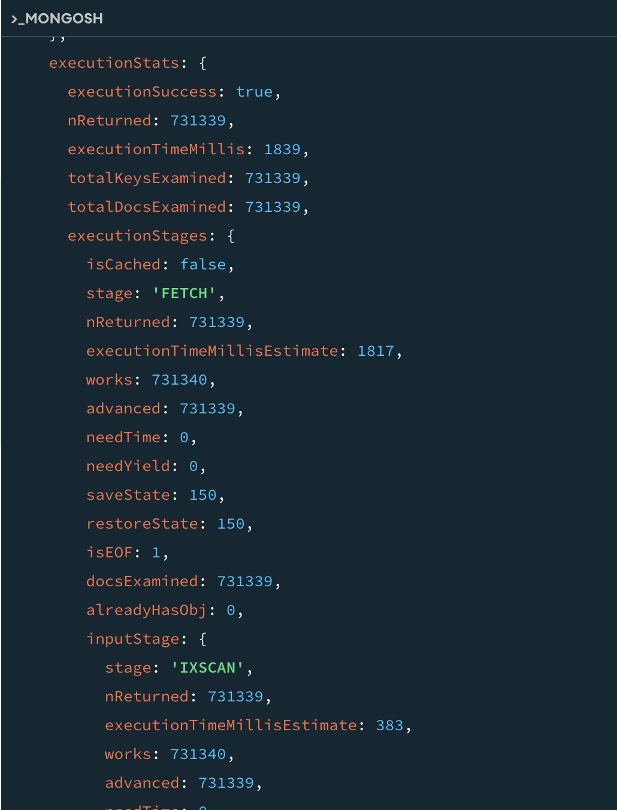
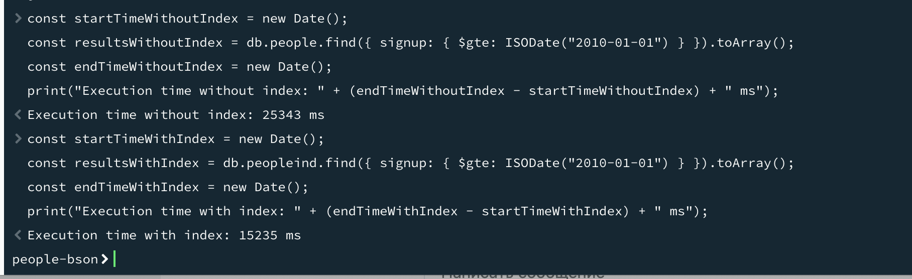

# MongoDB

## Задание

Необходимо:
- установить MongoDB одним из способов: ВМ, докер;
- заполнить данными;
- написать несколько запросов на выборку и обновление данных.

**Задание повышенной сложности:**
- создать индексы и сравнить производительность.

### Установка

1. Скачивание mongo из терминала docker-desktop ```docker pull mongo```

2. Запуск образа


3. Подключение из compass


### Заполнение данными
4. Заливка данных из [mongodb-json-files](https://github.com/ozlerhakan/mongodb-json-files/tree/master)

```unzip people-bson.zip -d dump```

```docker cp ./dump hw3_mongo:/```

из командной строки докера 

```mongorestore --gzip --drop --uri mongodb://localhost:27017/```


### Запросы

1. Чтение данных ```db.getCollection('people').find()```


2. Фильтрация по значению ```db.people.find( {name: 'Dan'})```

3. Проекция, т.е. выводимые поля с фильтром ```db.people.find({}, {name: 'Dan'})```
``` json
{
  _id: ObjectId('57605d5dc3d5a2429db0bce8'),
  name: 'Dan'
}
{
  _id: ObjectId('57605d5dc3d5a2429db0bce9'),
  name: 'Dan'
}
```

4. Проекция, но фильтр отдельно ```db.people.find( {name: 'Dan'},{_id:0, name:1, points:1})```
``` json
{
  points: 759453,
  name: 'Dan'
}
{
  points: 396091,
  name: 'Dan'
}
```

5. Оператор "больше" ```db.people.find({name: 'Dan', points: {$gt:500000}},{padding:0})```
``` json
{
  _id: ObjectId('57605d5dc3d5a2429db0bcfb'),
  signup: 2007-10-15T05:30:18.000Z,
  points: 759453,
  name: 'Dan'
}
{
  _id: ObjectId('57605d5dc3d5a2429db0bd57'),
  signup: 2015-01-21T10:12:22.000Z,
  points: 555863,
  name: 'Dan'
}
```

6. Оператор in ```db.people.find({name: {$in:['Alice', 'Luke']}},{padding:0})```
``` json
{
  _id: ObjectId('57605d5dc3d5a2429db0bcf5'),
  signup: 2012-02-03T01:10:50.000Z,
  points: 763380,
  name: 'Alice'
}
{
  _id: ObjectId('57605d5dc3d5a2429db0bcf9'),
  signup: 2009-06-29T04:48:31.000Z,
  points: 94135,
  name: 'Alice'
}
{
  _id: ObjectId('57605d5dc3d5a2429db0bcfa'),
  signup: 2010-01-14T03:18:15.000Z,
  points: 97773,
  name: 'Luke'
}
```

7. Обновление названия поля во всех документах
``` javascript
db.people.updateMany(
   { 'name': { $ne: null} }, { $rename: { 'name': 'username' } }
)
{
  acknowledged: true,
  insertedId: null,
  matchedCount: 1000000,
  modifiedCount: 1000000,
  upsertedCount: 0
}
```
8. Обновление документа по ObjectId
``` javascript
db.people.updateOne(
   { _id: ObjectId('57605d5dc3d5a2429db0bcf5') },
   { $set:
      {
        username: 500,
        points: [ 97773, 763380 ]
      }
   }
)
```

``` json
{
  acknowledged: true,
  insertedId: null,
  matchedCount: 1,
  modifiedCount: 1,
  upsertedCount: 0
}
```
Проверка результата
``` javascript
db.people.find({_id: ObjectId('57605d5dc3d5a2429db0bcf5') })
```
``` json
{
  _id: ObjectId('57605d5dc3d5a2429db0bcf5'),
  padding: '0000000000000000000000000000000000000000000000000000000000000000000000000000000000000000000000000000000000000000000000000000000000000000000000000000000000000000000000000000000000000000000000000000000000000000000000000000000000000000000000000000000000000000000000000000000000000000000000000000000000000000000000000000000000000000000000000000000000000000000000000000000000000000000000000000000000000000000000000000000000000000000000000000000000000000000000000000000000000000000000000000000000000000000000000000000000000000000000000000000000000000000000000000000000000000000000000000000000000000000000000000000000000000000000000000000000000000000000000000000000000000000000000000000000000000000000000000000000000000000000000000000000000000000000000000000000000000000000000000000000000000000000000000000000000000000000000000000000000000000000000000000000000000000000000000000000000000000000000000000000000000000000000000000000000000000000000000000000000000000000000000000000000000000000000000000000000000000000000000000000000000',
  signup: 2012-02-03T01:10:50.000Z,
  points: [
    97773,
    763380
  ],
  username: 500
}
```

### Создание индексов

Копирование коллекции ```db.people.aggregate([{$out: "peopleind"}])```

``` javascript
db.peopleind.createIndex({ signup: 1 });

db.people.find({ signup: { $gte: ISODate("2010-01-01") } }).explain("executionStats");
```

``` json
executionStats: {
    executionSuccess: true,
    nReturned: 164410,
    executionTimeMillis: 565,
    totalKeysExamined: 0,
    totalDocsExamined: 1000000,
    executionStages: {
      isCached: false,
      stage: 'COLLSCAN',
```

```db.peopleind.find({ signup: { $gte: ISODate("2010-01-01") } }).explain("executionStats");```



### Сравнение производительности

``` javascript
const startTimeWithoutIndex = new Date();
const resultsWithoutIndex = db.people.find({ signup: { $gte: ISODate("2010-01-01") } }).toArray();
const endTimeWithoutIndex = new Date();
print("Execution time without index: " + (endTimeWithoutIndex - startTimeWithoutIndex) + " ms");
```

``` javascript
const startTimeWithIndex = new Date();
const resultsWithIndex = db.peopleind.find({ signup: { $gte: ISODate("2010-01-01") } }).toArray();
const endTimeWithIndex = new Date();
print("Execution time with index: " + (endTimeWithIndex - startTimeWithIndex) + " ms");
```




