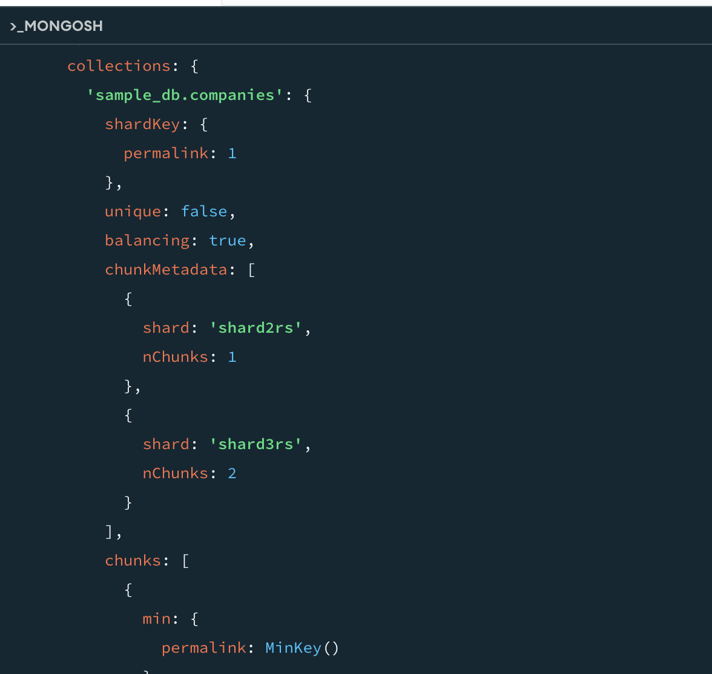
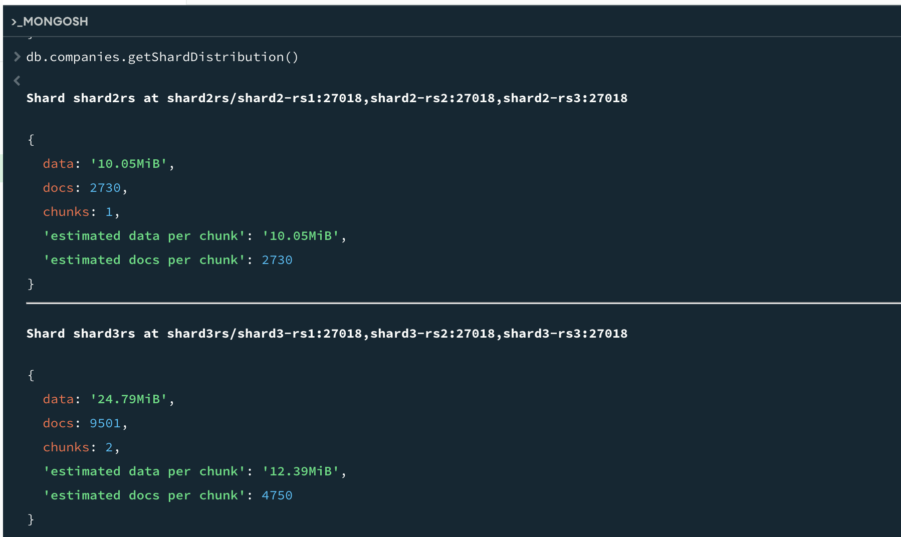

# MongoDB

## Задание

Необходимо:

- построить шардированный кластер из 3 кластерных нод( по 3 инстанса с репликацией) и с кластером конфига(3 инстанса);
- добавить балансировку, нагрузить данными, выбрать хороший ключ шардирования, 
- посмотреть как данные перебалансируются между шардами;
- поронять разные инстансы, посмотреть, что будет происходить, поднять обратно. Описать что произошло.
- настроить аутентификацию и многоролевой доступ;


## Установка

### 1. Заполнение docker-compose.yml 
[Файл docker-compose.yml](./HW4/docker-compose.yml )

### 2. Запуск docker compose up -d


В докере можно посмотреть состояние кластера


### 3. Инициализация Config Servers:
```bash

    docker exec -it cfg1 mongosh --port 27019 --eval "
rs.initiate({
  _id: 'cfgrs',
  configsvr: true,
  members: [
    { _id: 0, host: 'cfg1:27019' },
    { _id: 1, host: 'cfg2:27019' },
    { _id: 2, host: 'cfg3:27019' }
  ]
})"
    
```
### 4. Шарды (для каждого Replica Set):

Приоритеты:
    priority: 2 — главная нода (primary).
    priority: 1 — вторичная нода (может стать primary).
    priority: 0 — нода только для чтения (не может стать primary).


```bash

docker exec -it shard1-rs1 mongosh --port 27018 --eval "
rs.initiate({
  _id: 'shard1rs',
  members: [
    { _id: 0, host: 'shard1-rs1:27018', priority: 2 },
    { _id: 1, host: 'shard1-rs2:27018', priority: 1 },
    { _id: 2, host: 'shard1-rs3:27018', priority: 0 }
  ]
})"

docker exec -it shard2-rs1 mongosh --port 27018 --eval "
rs.initiate({
  _id: 'shard2rs',
  members: [
    { _id: 0, host: 'shard2-rs1:27018', priority: 2 },
    { _id: 1, host: 'shard2-rs2:27018', priority: 1 },
    { _id: 2, host: 'shard2-rs3:27018', priority: 0 }
  ]
})"

docker exec -it shard3-rs1 mongosh --port 27018 --eval "
rs.initiate({
  _id: 'shard3rs',
  members: [
    { _id: 0, host: 'shard3-rs1:27018', priority: 2 },
    { _id: 1, host: 'shard3-rs2:27018', priority: 1 },
    { _id: 2, host: 'shard3-rs3:27018', priority: 0 }
  ]
})"
```

### 5. Добавление шардов в кластер через Mongos:
```bash

    docker exec -it mongos mongosh --port 27017 --eval "
      sh.addShard('shard1rs/shard1-rs1:27018,shard1-rs2:27018,shard1-rs3:27018');
      sh.addShard('shard2rs/shard2-rs1:27018,shard2-rs2:27018,shard2-rs3:27018');
      sh.addShard('shard3rs/shard3-rs1:27018,shard3-rs2:27018,shard3-rs3:27018');
    "
```

Статус:
```bash
docker exec -it mongos mongosh --port 27017 --eval "sh.status()"
```


### 6. Балансировка

На уровне клиентского драйвера
```mongodb://localhost:27017/?readPreference=secondaryPreferred```

### 7. Загрузка данных


### 8. Ключ шардирования и сам процесс

Проверка шардирования коллекции. Вывод пустой, значит, шардирования нет.
```javascript
use config
db.collections.find({ _id: "sample_db.companies" })
```


Включение шардирования для базы

```sh.enableSharding("sample_db")```

Создание индекса по ключу шардирования

```db.companies.createIndex({ permalink: 1 })```


Проверка, что коллекция сейчас не шардирована, возвращает null, это ок

```javascript
use config
db.collections.findOne({ _id: "sample_db.companies" })
```

Проверка на каком шарде находятся данные

```javascript
use sample_db
db.companies.getShardDistribution()
```


Коллекция слишком маленькая, нужно сократить размер чанка
```javascript
use config
db.settings.updateOne(
  { _id: "chunksize" },
  { $set: { value: 10 } },  // Размер в MB
  { upsert: true }
)
```

Проверка балансировки - общий статус 


Статистика по распределению данных



### 8. Поронять разные инстансы, посмотреть, что будет происходить, поднять обратно. Описать что произошло.

#### Тестирование отказоустойчивости отдельных нод в Replica Set

Определение текущего Primary для каждого шарда
```javascript
// Для shard1rs
mongosh --host shard1-rs1 --port 27018 --eval "rs.isMaster().primary"

// Для shard2rs
mongosh --host shard2-rs2 --port 27018 --eval "rs.isMaster().primary"

// Для shard3rs
mongosh --host shard3-rs1 --port 27018 --eval "rs.isMaster().primary"
```


Остановка Primary ноды ```docker stop shard2-rs1```

Primary перевыбралась


Подключаемся, чтобы проверить
```mongosh "mongodb://shard2-rs2:27018"```

```javascript
rs.status().members.forEach(m => {
  printjson({
    name: m.name,
    stateStr: m.stateStr,
    health: m.health,
    lastHeartbeat: new Date(m.lastHeartbeat)
  })
})
```


Включаем ноду обратно ```docker start shard2-rs1```


#### Тестирование отказа шарда 

Остановка всех нод shard2rs ```docker stop shard2-rs1 shard2-rs2 shard2-rs3```

Проверка состояния кластера ```h.status();``` выдает все шарды в состоянии 1

Проверка посчитать ```db.companies.countDocuments();```
MongoServerError[FailedToSatisfyReadPreference]: Could not find host matching read preference { mode: "secondaryPreferred" } for set shard2rs

Попытка записи прошла успешно - "Write succeeded"
```javascript
mongosh sample_db --eval "
  try {
    db.companies.insertOne({ name: 'Test Company', permalink: 'test-company-' + new Date().getTime() });
    print('Write succeeded');
  } catch(e) { print('Write failed:', e); }
"
```
Проверка распределения не проходит ```db.companies.getShardDistribution()```
MongoServerError[FailedToSatisfyReadPreference]: Could not find host matching read preference { mode: "secondaryPreferred" } for set shard2rs


Восстановление шарда ```docker start shard2-rs1 shard2-rs2 shard2-rs3```

Количество посчиталось - 9502 
```db.companies.countDocuments();```
Проверка распределения теперь прошла ```db.companies.getShardDistribution()```
{
  data: '34.78MiB',
  docs: 9502,
  chunks: 2,
  'Shard shard3rs': [
    '71.08 % data',
    '71.26 % docs in cluster',
    '3KiB avg obj size on shard'
  ],
  'Shard shard2rs': [
    '28.91 % data',
    '28.73 % docs in cluster',
    '3KiB avg obj size on shard'
  ]
}

Получается, были доступны данные на включенных шардах, запись и чтение ок, а запросы, затрагивающие данные на отключенном шарде, будут падать

### 9. Настроить аутентификацию и многоролевой доступ;

## P.S. Полезные команды
Приостановка балансировки

```sh.stopBalancer()```

Запуск для конкретной коллекции

```sh.enableBalancing("mydb.mycollection")```


Для соединения с монго в докере
``` bash
echo "127.0.0.1 mongo1" | sudo tee -a /etc/hosts
echo "127.0.0.1 mongo2" | sudo tee -a /etc/hosts
echo "127.0.0.1 mongo3" | sudo tee -a /etc/hosts
```

Для прямого соединения с бд указывать параметр directConnection

```mongosh "mongodb://localhost:27017/?readPreference=secondaryPreferred&directConnection=true"```

Команда для подключения должна быть в кавычках, внутри перечисление хостов

```mongosh "mongodb://localhost:30001,localhost:30002,localhost:30003/?replicaSet=myReplicaSet"```

Мониторинг процесса балансировки
```javascript

// Проверить активные миграции
use config
db.locks.find({ _id: "balancer" }).pretty()

// Логи балансировщика
db.adminCommand({ getLog: "balancer" })
```

Оптимизация 
```javascript

// Для больших коллекций можно настроить размер чанка
use config
db.settings.updateOne(
  { _id: "chunksize" },
  { $set: { value: 64 } },  // Размер в MB
  { upsert: true }
)

// Принудительное разделение чанков
sh.splitAt("sample_db.companies", { permalink: "m" }) 
```

Дополнительные команды для диагностики

```javascript
// Проверить статистику по шардам
db.adminCommand({ listShards: 1 })

// Детальная информация по конкретному чанку
use config
db.chunks.findOne({ ns: "sample_db.companies" })

// Принудительная балансировка конкретной коллекции
sh.moveChunk("sample_db.companies", { permalink: "twitter" }, "shard2")
```