# Couchbase

## Задание

Необходимо:
- Развернуть кластер Couchbase
- Создать БД, наполнить небольшими тестовыми данными
- Проверить отказоустойчивость

### Разворачиваем кластер

#### 1. Подготовка docker-compose.yml
В Couchbase используется несколько портов для разных сервисов:
1. 8091-8097 - Основные порты:
    - 8091 - Web UI и REST API
    - 8092-8094 - Query/Index/N1QL сервисы
    - 8095 - Full-text search
    - 8096 - Analytics
    - 8097 - Eventing
2. 9123 - Prometheus-метрики
3. 11207-11211 - Важные внутренние порты:
    - 11207 - SSL для кластерного взаимодействия
    - 11210 - Memcached protocol (основной доступ к данным)
    - 11211 - Legacy Memcached

Для задачи достаточно будет 8091 и 11210, остальные оставляю для примера.

``` yml
services:
  db1.lan:
    image: couchbase:7.6.2
    container_name: db1.lan
    hostname: db1.lan
    healthcheck:
      test: ["CMD", "curl", "-f", "http://localhost:8091/pools"]
    ports:
      - "8091:8091"
      - "8092:8092"
      - "8093:8093"
      - "8094:8094"
      - "8095:8095"
      - "8096:8096"
      - "8097:8097"
      - "9102:9102"
      - "11210:11210"
      - "11211:11211"
    networks:
      - couchbase-net
    environment:
      - COUCHBASE_USER=${COUCHBASE_USER}
      - COUCHBASE_PASSWORD=${COUCHBASE_PASSWORD}
      - COUCHBASE_CLUSTER_NAME=${COUCHBASE_CLUSTER_NAME:-MyCluster}
      - COUCHBASE_SERVICES=kv,index,n1ql,fts,analytics,eventing,backup
      - COUCHBASE_INDEX_STORAGE_SETTING=memopt
    volumes:
      - node1-data:/opt/couchbase/var
```
Для двух других нод удобнее сделать ```CLUSTER_INIT_HOST=couchbase-node1``` - указание, к какому узлу должны подключаться другие узлы при старте. Couchbase не может автоматически выбрать мастер-узел при первом запуске, но это можно сделать вручную через UI или REST API

Когда можно не использовать CLUSTER_INIT_HOST?
1. При использовании Couchbase Autonomous Operator (Kubernetes)
2. При ручной инициализации кластера через API
3. В некоторых облачных развертываниях с предустановленными конфигурациями

```docker compose up -d```
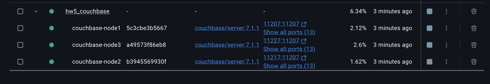

#### 2. Обновление /etc/hosts

```bash
    echo -e "127.0.0.1 db1.lan db2.lan db3.lan" | sudo tee -a /etc/hosts
```

#### 3. Инициализация кластера

Веб-интерфейс Couchbase доступен по адресу: http://localhost:8091
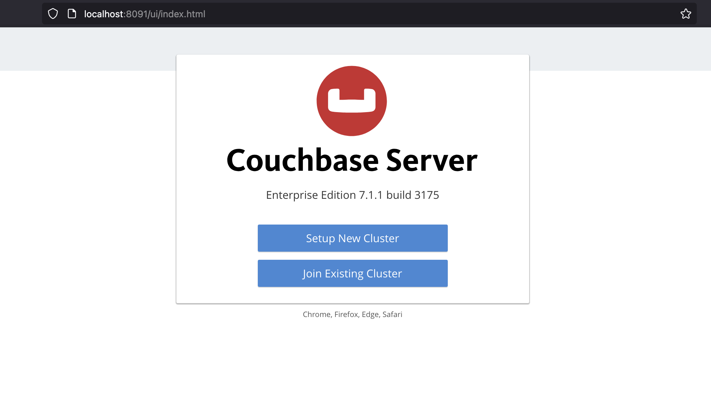

Указываем имя администратора и пароль
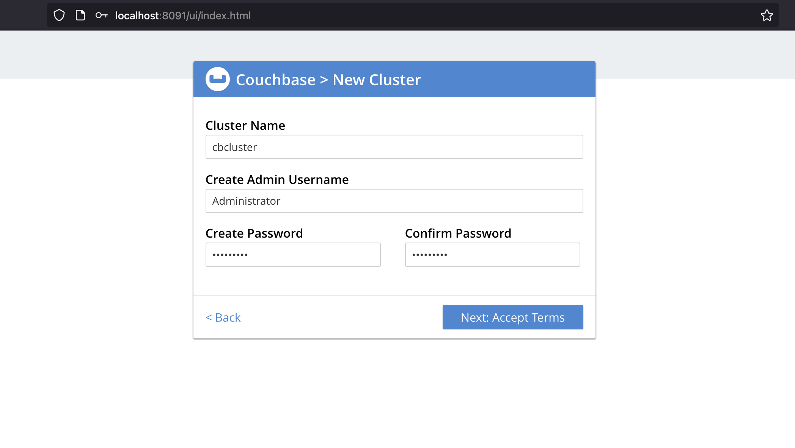

Необходимо добавить все три ноды, используя имена хостов. Некоторые настройки пришлось отключить, чтобы прошло по требованиям свободной памяти.
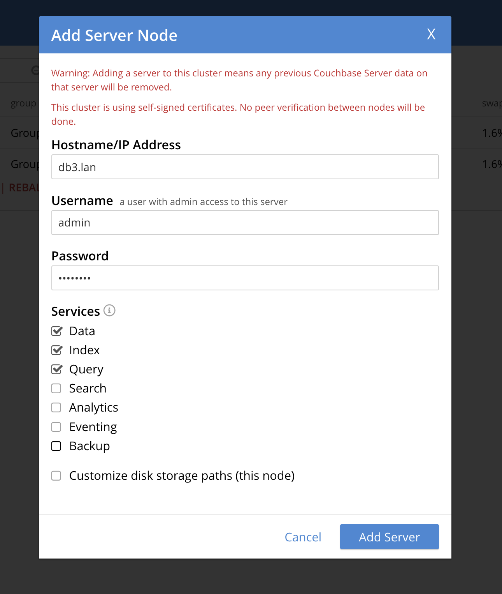

Такие же настройки можно выполнить и в конфиге
``` yml
services:
  couchbase-node1:
    image: couchbase/server:7.1.1
    container_name: couchbase-node1
    ports:
      - "8091:8091"  
      - "11210:11210" 
    healthcheck:
      test: ["CMD", "curl", "-f", "http://localhost:8091/pools"]
    environment:
      - CLUSTER_NAME=test_cluster
      - COUCHBASE_ADMINISTRATOR_USERNAME=admin
      - COUCHBASE_ADMINISTRATOR_PASSWORD=password
      - CLUSTER_INDEX_QUOTA=0    # Отключаем индексы
      - CLUSTER_FTS_QUOTA=0      # Отключаем полнотекстовый поиск
      - CLUSTER_EVENTING_QUOTA=0 # Отключаем Eventing
    volumes:
      - node1-data:/opt/couchbase/var
```
Для очистки дисков можно сделать их удаление в приложении docker, либо удалить в консоли
```bash
docker volume ls | grep couchbase
docker volume rm  hw5_couchbase_node2-data hw5_couchbase_node1-data hw5_couchbase_node3-data
```
либо останавливать контейнеры с командой ```docker compose down -v```

После добавления ноды видны во вкладке Servers


Обязательным шагом является ребалансировка 
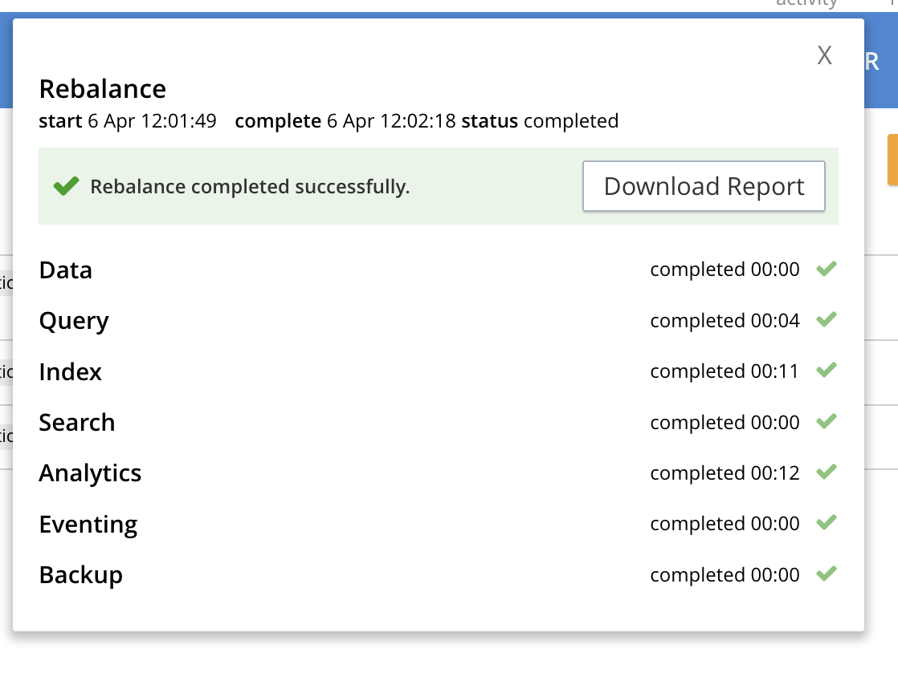

### БД и наполнение данными

Создание базы данных - бакета возможно вручную
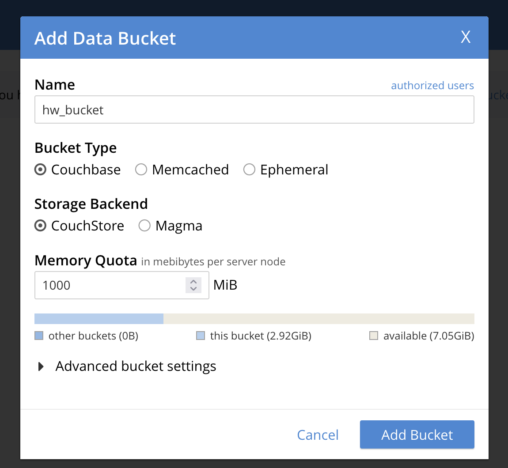

Но есть удобная фича - доступны тестовые датасеты в разделе настройки
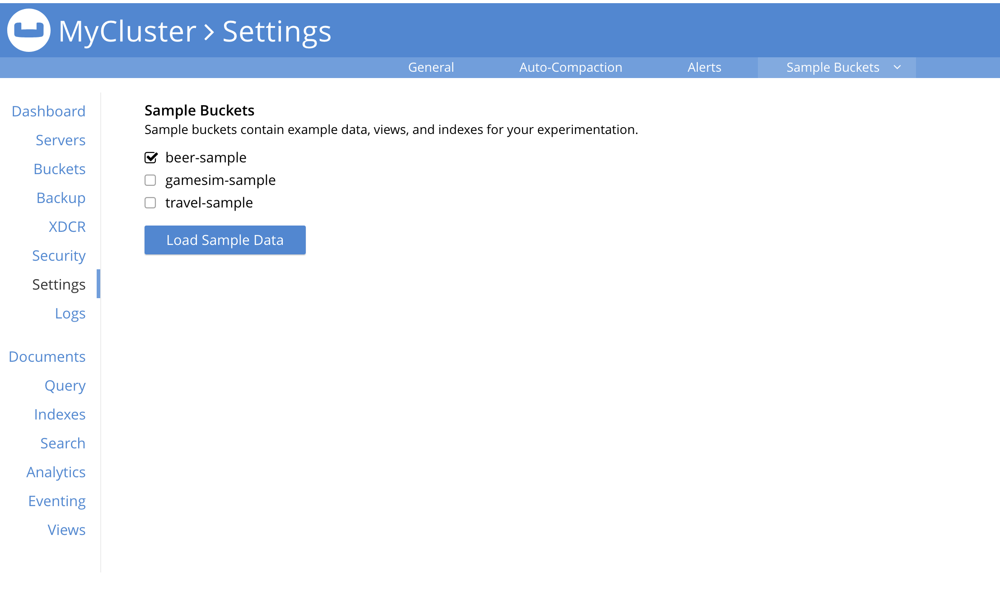

В отдельном окне доступен просмотр данных и выполнение запросов
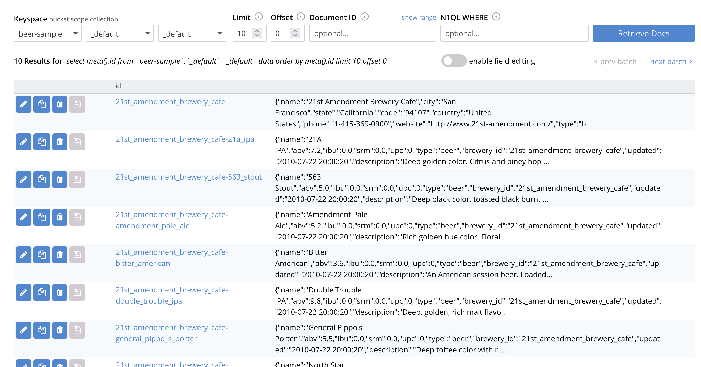

### Отказоустойчивость

Для проверки отказоустойчивости останавливаем db2.lan ```docker stop db2.lan```
Автоматически появляется всплывающее сообщение
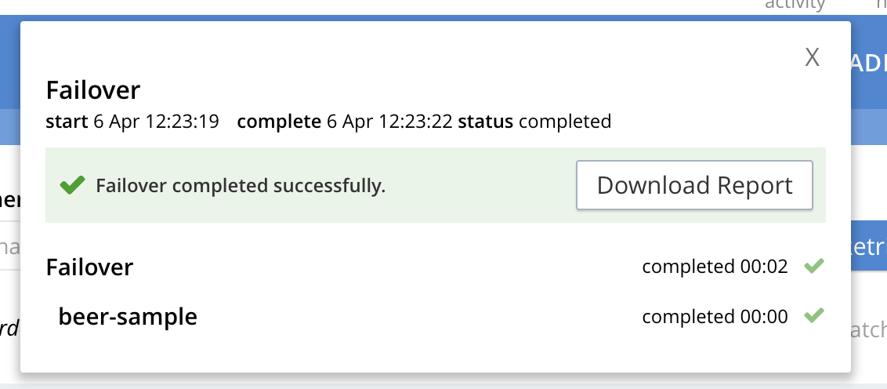

В списке серверов отображается, что нода недоступна 
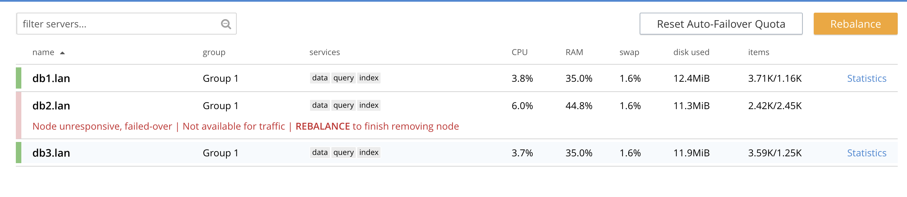

Теперь проверяем доступность данных:
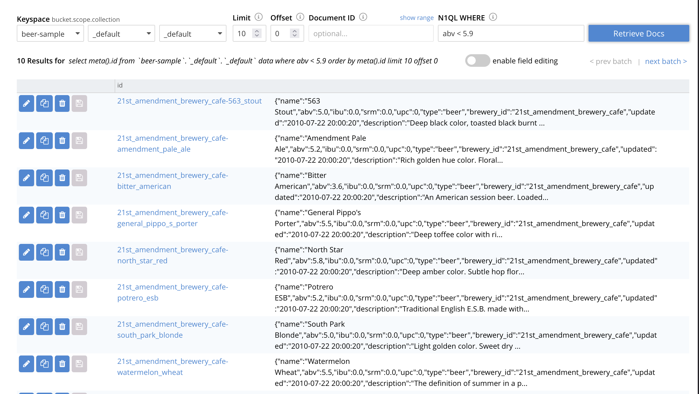
Видим, что данные доступны, несмотря на отказ узла, это возможно через реплики на других узлах

Восстанавливаем узел: ```docker start couchbase-node2```

Узел автоматически возвращается в кластер
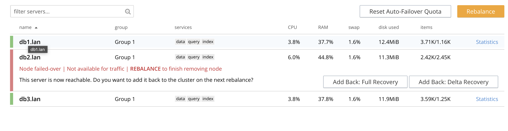

Требуется выполнить rebalance для полного восстановления
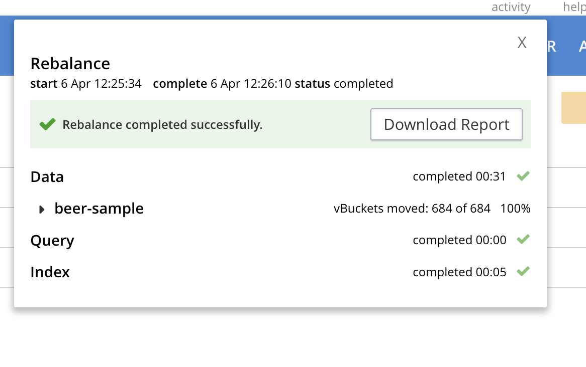

Ребалансировка завершилась, все данные и ноды доступны