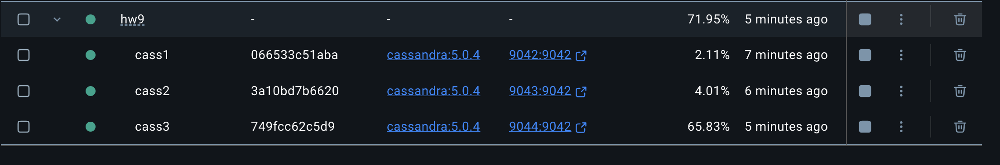
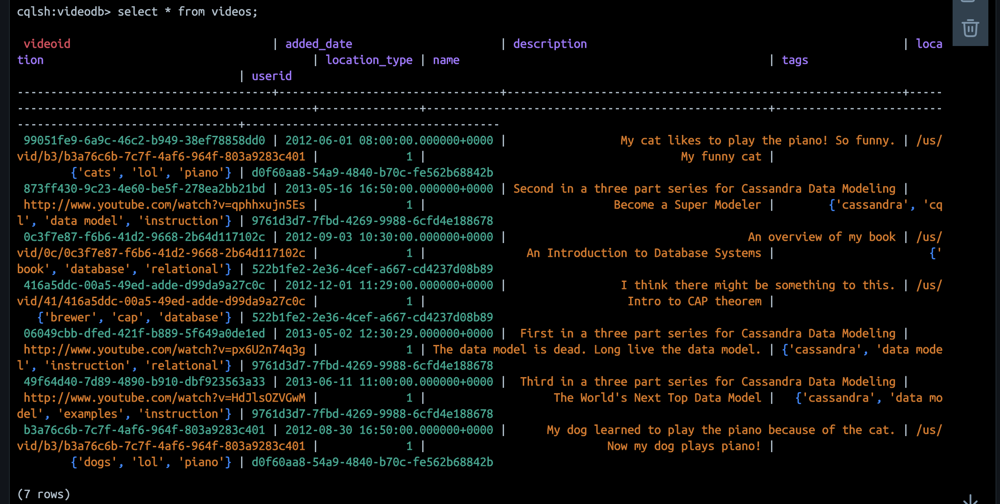
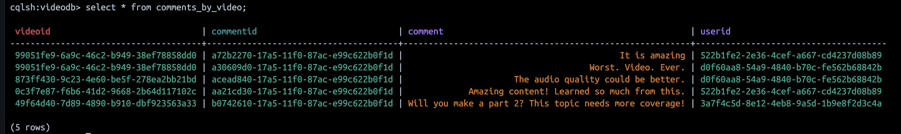
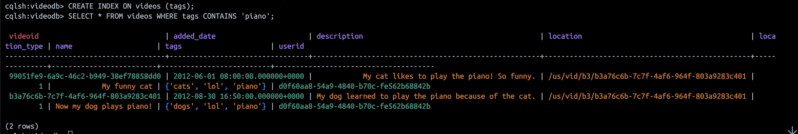
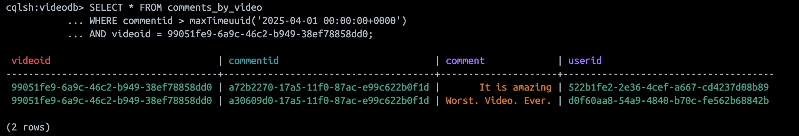
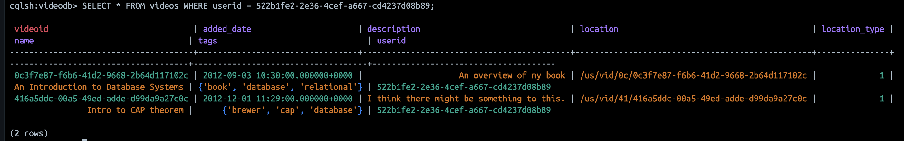

# Cassandra

## Задание

Необходимо:
- развернуть docker локально или в облаке
- поднять 3 узловый Cassandra кластер.
- Создать keyspase с 2-мя таблицами. Одна из таблиц должна иметь составной Partition key, как минимум одно поле - clustering key, как минимум одно поле не входящее в primiry key.
- Заполнить данными обе таблицы.
- Выполнить 2-3 варианта запроса использую WHERE
- Создать вторичный индекс на поле, не входящее в primiry key.
- (*) нагрузить кластер при помощи Cassandra Stress Tool (используя "[How to use Apache Cassandra Stress Tool](https://www.google.com/url?sa=t&source=web&rct=j&opi=89978449&url=https://medium.com/ksquare-inc/how-to-use-apache-cassandras-stress-tool-a-step-by-step-guide-649ea26daa5d&ved=2ahUKEwjeiZXonsWMAxVmr1YBHXVtKK4QFnoECCgQAQ&usg=AOvVaw2M5kP1WmPnQzFnsCBH0kMF).pdf").


### Разворачиваем кластер

#### 1. Подготовка docker-compose.yml
Разворачиваем кластер Cassandra из 3 узлов (cass1, cass2, cass3) версии 5.0.4
[Файл docker-compose.yml](./HW9/docker-compose.yml)

Настройки кластера:
- Имя кластера: SolarSystem
- Дата-центр: Mars
- Rack: West
- Snitch: GossipingPropertyFileSnitch
- Количество токенов: 128

Для каждого узла создаются отдельные директории для данных и конфигурации. Доступность проверяется через cqlsh.
Зависимости: cass2 ждёт cass1, cass3 ждёт cass2

Потребовалось прописать следующие конфиги, т.к. логе видно, что JVM выделено -Xms3919M -Xmx3919M (~4GB), но в docker-compose.yml стоит mem_limit: 2g.

```yml
JVM_OPTS: -Xms512M -Xmx1024M
MAX_HEAP_SIZE: 1G
HEAP_NEWSIZE: 256M
```


Подключение утилитой cqlsh и просмотр схемы ```describe keyspaces; ```
Можно посмотреть ```describe tables;```
```bash
# cqlsh
Connected to SolarSystem at 127.0.0.1:9042
[cqlsh 6.2.0 | Cassandra 5.0.4 | CQL spec 3.4.7 | Native protocol v5]
Use HELP for help.
cqlsh> describe keyspaces;

system       system_distributed  system_traces  system_virtual_schema
system_auth  system_schema       system_views 
```

#### 2. Keyspace и таблицы

Создать keyspase с 2-мя таблицами. Одна из таблиц должна иметь составной Partition key, как минимум одно поле - clustering key, как минимум одно поле не входящее в primiry key.

```bash
cqlsh> CREATE KEYSPACE videodb WITH REPLICATION = { 'class' : 'SimpleStrategy', 'replication_factor' : 3 };
cqlsh> use videodb;
cqlsh:videodb> CREATE TABLE videos (
           ...    videoid uuid,
           ...    userid uuid,
           ...    name varchar,
           ...    description varchar,
           ...    location text,
           ...    location_type int,
           ...    tags set<varchar>,
           ...    added_date timestamp,
           ...    PRIMARY KEY (videoid)
           ... );
cqlsh:videodb> CREATE TABLE comments_by_video (
           ...    videoid uuid,
           ...    commentid timeuuid,
           ...    userid uuid,
           ...    comment text,
           ...    PRIMARY KEY (videoid, commentid)
           ... ) WITH CLUSTERING ORDER BY (commentid DESC);
cqlsh:videodb> DESCRIBE TABLES;

comments_by_video  videos

cqlsh:videodb> 
```
#### 3. Вставка данных

Данные для таблицы видео

```sql
INSERT INTO videos (videoid, name, userid, description, location, location_type, tags, added_date)
VALUES (99051fe9-6a9c-46c2-b949-38ef78858dd0,'My funny cat',d0f60aa8-54a9-4840-b70c-fe562b68842b, 'My cat likes to play the piano! So funny.','/us/vid/b3/b3a76c6b-7c7f-4af6-964f-803a9283c401',1,{'cats','piano','lol'},'2012-06-01 08:00:00');

INSERT INTO videos (videoid, name, userid, description, location, location_type,  tags, added_date)
VALUES (b3a76c6b-7c7f-4af6-964f-803a9283c401,'Now my dog plays piano!',d0f60aa8-54a9-4840-b70c-fe562b68842b, 'My dog learned to play the piano because of the cat.','/us/vid/b3/b3a76c6b-7c7f-4af6-964f-803a9283c401',1,{'dogs','piano','lol'},'2012-08-30 16:50:00');

INSERT INTO videos (videoid, name, userid, description, location, location_type,  tags, added_date)
VALUES (0c3f7e87-f6b6-41d2-9668-2b64d117102c,'An Introduction to Database Systems',522b1fe2-2e36-4cef-a667-cd4237d08b89, 'An overview of my book','/us/vid/0c/0c3f7e87-f6b6-41d2-9668-2b64d117102c',1,{'database','relational','book'},'2012-09-03 10:30:00');

INSERT INTO videos (videoid, name, userid, description, location, location_type,  tags, added_date)
VALUES (416a5ddc-00a5-49ed-adde-d99da9a27c0c,'Intro to CAP theorem',522b1fe2-2e36-4cef-a667-cd4237d08b89, 'I think there might be something to this.','/us/vid/41/416a5ddc-00a5-49ed-adde-d99da9a27c0c',1,{'database','cap','brewer'},'2012-12-01 11:29:00');

INSERT INTO videos (videoid, name, userid, description, location, location_type,  tags, added_date)
VALUES (06049cbb-dfed-421f-b889-5f649a0de1ed,'The data model is dead. Long live the data model.',9761d3d7-7fbd-4269-9988-6cfd4e188678, 'First in a three part series for Cassandra Data Modeling','http://www.youtube.com/watch?v=px6U2n74q3g',1,{'cassandra','data model','relational','instruction'},'2013-05-02 12:30:29');

INSERT INTO videos (videoid, name, userid, description, location, location_type,  tags, added_date)
VALUES (873ff430-9c23-4e60-be5f-278ea2bb21bd,'Become a Super Modeler',9761d3d7-7fbd-4269-9988-6cfd4e188678, 'Second in a three part series for Cassandra Data Modeling','http://www.youtube.com/watch?v=qphhxujn5Es',1,{'cassandra','data model','cql','instruction'},'2013-05-16 16:50:00');

INSERT INTO videos (videoid, name, userid, description, location, location_type,  tags, added_date)
VALUES (49f64d40-7d89-4890-b910-dbf923563a33,'The World''s Next Top Data Model',9761d3d7-7fbd-4269-9988-6cfd4e188678, 'Third in a three part series for Cassandra Data Modeling','http://www.youtube.com/watch?v=HdJlsOZVGwM',1,{'cassandra','data model','examples','instruction'},'2013-06-11 11:00:00');
```

Смотрим, что получилось



```sql
INSERT INTO comments_by_video (videoid, userid, commentid, comment)
VALUES (99051fe9-6a9c-46c2-b949-38ef78858dd0,d0f60aa8-54a9-4840-b70c-fe562b68842b,now(), 'Worst. Video. Ever.');

INSERT INTO comments_by_video (videoid, userid, commentid, comment)
VALUES (99051fe9-6a9c-46c2-b949-38ef78858dd0,522b1fe2-2e36-4cef-a667-cd4237d08b89,now(), 'It is amazing');

INSERT INTO comments_by_video (videoid, userid, commentid, comment)
VALUES (0c3f7e87-f6b6-41d2-9668-2b64d117102c, 522b1fe2-2e36-4cef-a667-cd4237d08b89, now(), 'Amazing content! Learned so much from this.');

INSERT INTO comments_by_video (videoid, userid, commentid, comment)
VALUES (873ff430-9c23-4e60-be5f-278ea2bb21bd, d0f60aa8-54a9-4840-b70c-fe562b68842b, now(), 'The audio quality could be better.');

INSERT INTO comments_by_video (videoid, userid, commentid, comment)
VALUES (49f64d40-7d89-4890-b910-dbf923563a33, 3a7f4c5d-8e12-4eb8-9a5d-1b9e8f2d3c4a, now(), 'Will you make a part 2? This topic needs more coverage!');
```


#### 4. Запросы и фильтрация, добавление индексов

```sql
CREATE INDEX ON videos (tags);
SELECT * FROM videos WHERE tags CONTAINS 'piano';
```



Комментарии, созданные после определенной даты
```sql
SELECT * FROM comments_by_video 
WHERE commentid > maxTimeuuid('2025-04-01 00:00:00+0000') 
AND videoid = 99051fe9-6a9c-46c2-b949-38ef78858dd0;
```


```sql
CREATE INDEX ON videos (userid);
SELECT * FROM videos WHERE userid = 522b1fe2-2e36-4cef-a667-cd4237d08b89;
```
